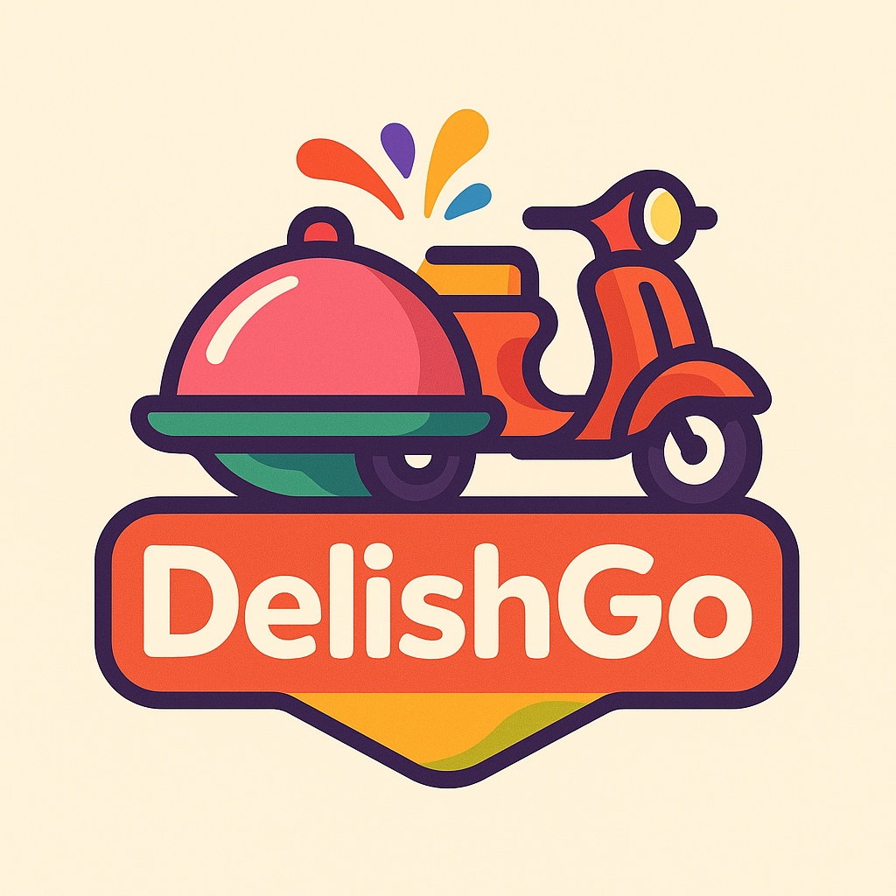
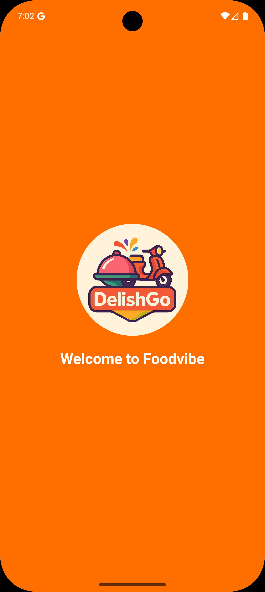
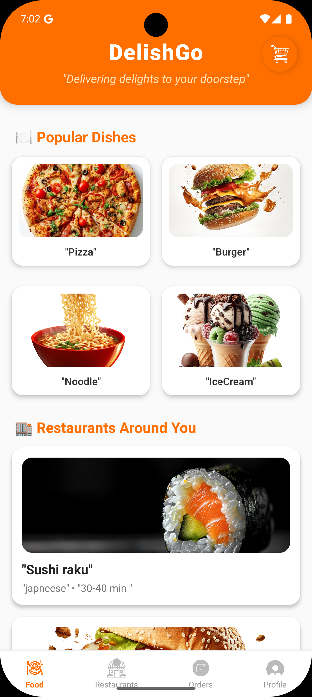
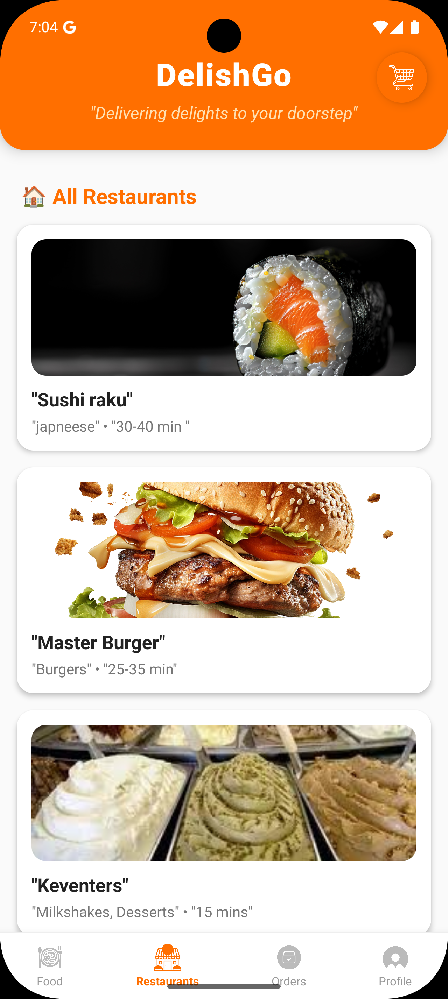
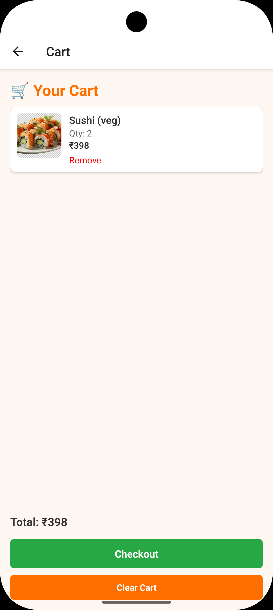
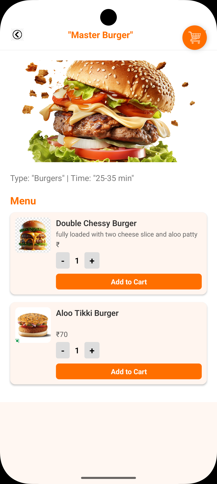
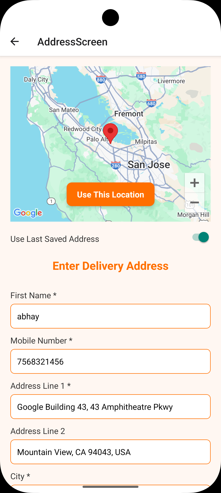
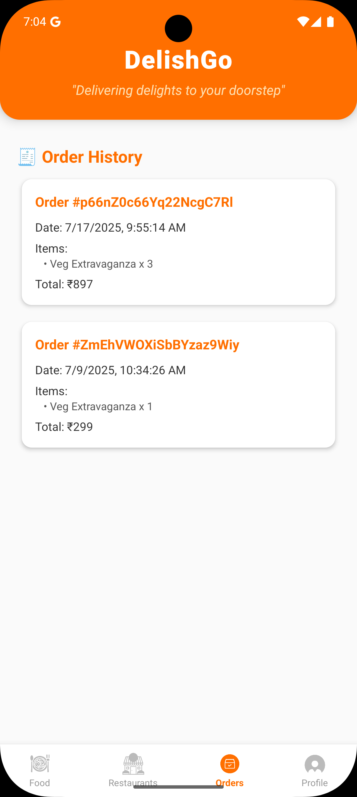

# 🍔 DelishGo — The Food Delivery App



[](https://reactnative.dev/)
[](https://firebase.google.com/)
[](LICENSE)

A modern, feature-rich food delivery app built with **React Native CLI**, featuring Firebase Authentication, Firestore, Google Maps, Cart functionality, Category-based browsing, and more — inspired by Swiggy/Zomato.

---

## ✨ Features

- 🔐 **Authentication** — Sign in / Register with Email or Google
- 📍 **Location Picker** — Use Google Maps to pick delivery address
- 🍽️ **Food & Restaurant Listing** — Categorized & filtered menu
- 🛒 **Add to Cart** — Smart cart with quantity control
- 🧾 **Order Summary** — Preview orders before checkout
- 🔍 **Search & Filters** — Find dishes and restaurants quickly
- 🌗 **Beautiful UI** — Clean, animated, modern UI/UX

---

## 📸 Screenshots

<table>
  <tr>
    <td></td>
    <td></td>
    <td></td>
    <td></td>
  </tr>
  <tr>
    <td>Splash Screen</td>
    <td>Home Screen</td>
    <td>Restaurant Details</td>
    <td>Cart</td>
  </tr>
  <tr>
    <td></td>
    <td></td>
    <td></td>
    <td></td>
  </tr>
  <tr>
    <td>Add Item</td>
    <td>Address Screen</td>
    <td>Order Details</td>
    <td></td>
  </tr>
</table>

> 📂 Place all screenshots inside a `/screenshots` folder in your repo.

---

## 🛠️ Tech Stack

- **Frontend:** React Native CLI, Redux Toolkit, React Navigation
- **Backend:** Firebase Authentication, Firestore DB
- **Notifications:** Firebase Cloud Messaging (FCM)
- **Location:** React Native Maps, Geolocation
- **UI Components:** React Native Paper, Custom Styling

---

## 📦 Installation

```bash
# 1. Clone the repo
git clone https://github.com/Abhay-singh-rathore/DelishGo--The-Food-Delivery-App.git
cd DelishGo--The-Food-Delivery-App

# 2. Install dependencies
npm install

# 3. Link native dependencies (only for older RN versions)
npx react-native link

# 4. Run on Android
npx react-native run-android

# 5. Run on iOS (Mac only)
npx react-native run-ios
